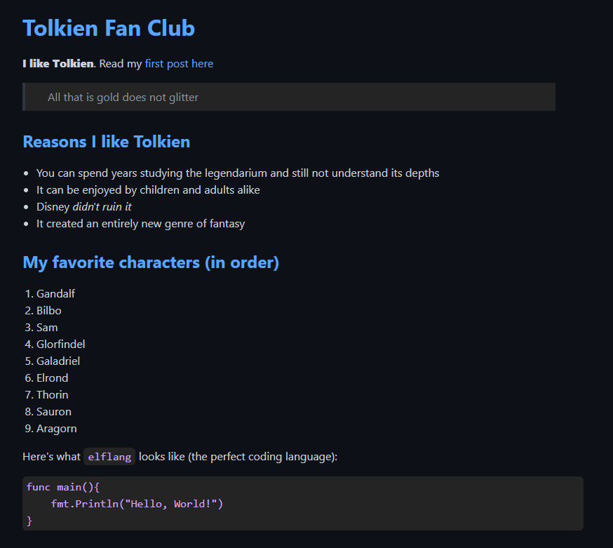

# Static Site Generator


[boot.dev](https://boot.dev) Static Site Generator

A python application that converts markdown files into html. The SSG script will first convert your markdown into html then setup a python http server for you to view the final result.

## Input

```
# Tolkien Fan Club

**I like Tolkien**. Read my [first post here](/majesty)

> All that is gold does not glitter

## Reasons I like Tolkien

* You can spend years studying the legendarium and still not understand its depths
* It can be enjoyed by children and adults alike
* Disney *didn't ruin it*
* It created an entirely new genre of fantasy

...
```

## Output



## Setup

Sample files are already included in this repository, but you can alter the content with these steps:

1. Build your markdown files representing your website content. These files should be markdown files (.md) and placed inside the `/content` folder.
2. Place all your static files into the `/static` folder. This should include any css and images.
3. (Optional) Edit the `template.html` to change the template that is used for the html.
4. (Optional) Edit the `main.sh` to further configure/alter the http server and edit `src/main.py` to change any of the folder locations should you choose to rename them.

## Usage

To start the website, simply run the main script:

```
./main.sh
```

The console will output the content files it converted to html and let you know the server is ready.

- Generating page from content/majesty/index.md to public/majesty/index.html using template.html
- Generating page from content/index.md to public/index.html using template.html
- Serving HTTP on 0.0.0.0 port 8888 ...

Output is placed and served via the `/public` folder by default.

## Algorithm Explanation

The rough psuedocode for this application's markdown to html converter is as follows:

1. Start with the markdown string.
2. Split the markdown into text blocks. Blocks represent each 'element' in markdown, such as a heading, paragraph, list, or code block.
3. Convert each text block into an html node as follows:
   - Detect the block's type and remove the associated characters.
   - Convert the remaining text into text nodes (pull out bold, italic, links, images, plain text, etc).
   - Convert the text nodes into equivalent html nodes.
   - Return a parent html node (using the block type) and set the children to the calculated html nodes.
4. Return a parent html node (div) with the aforementioned html nodes as children.

## Further Considerations

There are two primary improvements that could be made to this project:

1. Blocks must be seperated by two newline characters (an empty row inbetween). Typical markdown processors can handle just one newline character and detect either continuations of a prior element or a new element.
2. Nested delimiters are not supported. For example, you could not do '**bold text with *italic inside* the text**'.

Both improvements require more robust algorithms that actually parse the text. Both aforementioned shortcomings are due to strict delimiter splits being used instead.
